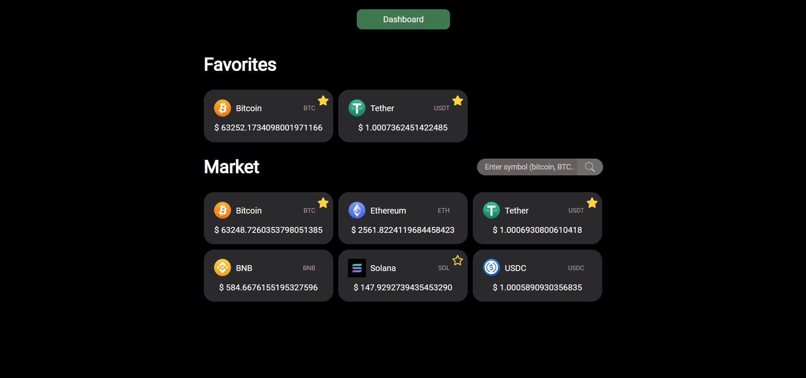
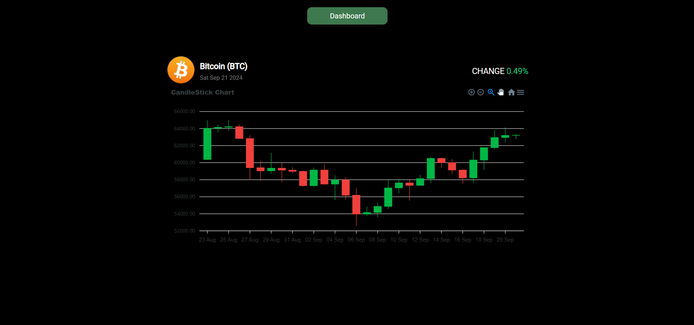

# Crypto Market

This project is a cryptocurrency dashboard that provides real-time price updates for popular cryptocurrencies. The dashboard includes charts, favorite lists, and a search function to help users monitor cryptocurrency market changes. The frontend is built using React and integrates with the **Crypto Market Backend** to fetch candlestick chart data and real-time asset details.

## Dashboard

The main dashboard provides an overview of your favorite cryptocurrencies and the market in general.

## Currency Detail

The detailed view shows candlestick charts and real-time price changes for individual cryptocurrencies.

## Features

- **Cryptocurrency Price Tracking**: Real-time updates for major cryptocurrencies like Bitcoin, Ethereum, and more.
- **Candlestick Chart**: Visualize price movements for different time periods.
- **Favorites Management**: Mark and view favorite cryptocurrencies for quick access, stored locally.
- **Search Functionality**: Quickly search for any cryptocurrency by symbol or name.

## Tech Stack

### Crypto Market Frontend

React.js with Vite for fast builds and efficient development.
The frontend communicates with the CoinCap API to fetch cryptocurrency data such as prices, symbols, and names. It also fetches candle data from the **Crypto Market Backend**.

- **Assets List**: The frontend makes a request to the CoinCap API to fetch a list of cryptocurrencies. Each asset is displayed with its name, symbol, price, and logo.
- **Asset Details**: When viewing a specific cryptocurrency, the frontend fetches additional details such as the 24-hour price change and candlestick chart data, which are obtained from the backend.
- **LocalStorage Integration**: The favorite cryptocurrencies selected by the user are stored in the browser's `localStorage`, allowing users to save their favorite assets and keep them after refreshing or returning to the page.

### Crypto Market Backend

The backend is built using Node.js and Express, and it uses the **ccxt** library to retrieve candlestick data from the Binance exchange. The backend API fetches OHLCV (Open, High, Low, Close, Volume) data for a specific cryptocurrency and returns it to the frontend.

- **Candlestick Data**: The backend fetches the historical price data for cryptocurrencies over a configurable time range (default is 30 days). This data is then formatted and returned as JSON to the frontend for rendering in a candlestick chart.