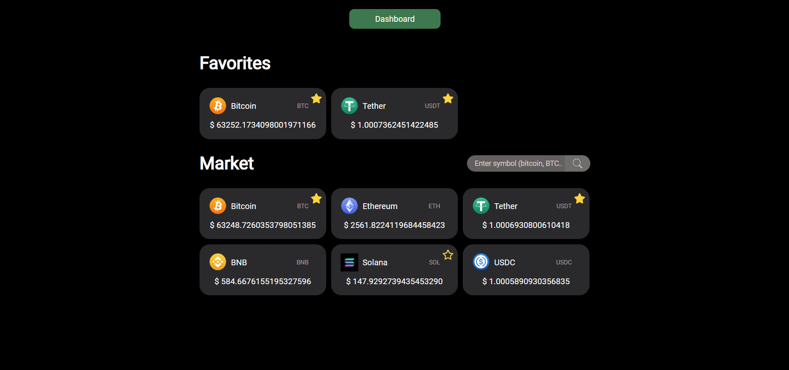
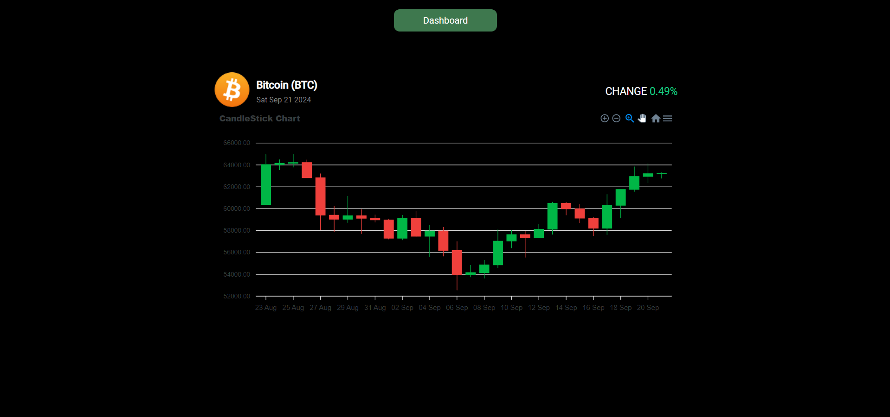

# 💹 Crypto Market [Frontend]

A responsive cryptocurrency dashboard that displays real-time price data and candlestick charts for major cryptocurrencies. Built with React and `styled-components`, it integrates with a custom backend to provide live price tracking and market analysis.

---

## ⚠️ Important Note

This project requires a running backend server for full functionality.  
Make sure to clone and start the server locally before using the frontend.

> 🔗 Backend repository: [crypto-market-be](https://github.com/dobbyssockk/crypto-market-be)

---

## 🧭 Project Overview

**Crypto Market** is a web application for monitoring cryptocurrency prices, viewing candlestick charts, and managing a personalized list of favorites. It uses routing, shared global state, and API integration with a separate backend service.

---

## 🚀 Features

- **Real-time price tracking** for top cryptocurrencies
- **Candlestick charts** for market analysis
- **Favorite list** (with persistence via context)
- **Search functionality** to quickly find coins
- **Responsive layout** for mobile and desktop
- **404 page** for invalid routes
- **Client-side routing** with React Router

---

## 🛠️ Technologies Used

- **React** – component-based UI
- **React Router** – SPA navigation
- **React Context API** – for global state (favorites)
- **styled-components** – CSS-in-JS styling
- **Vite** – fast development environment

---

## 💡 Key Concepts

- **Modular React architecture**: components, pages, and contexts
- **Dynamic routing**: `/currency/:id` to show coin-specific data
- **Separation of concerns**: backend handles real-time data, frontend handles presentation
- **Clean UI design**: with reusable layout and interaction patterns
- **Error handling**: fallback for 404 pages and unavailable coins
